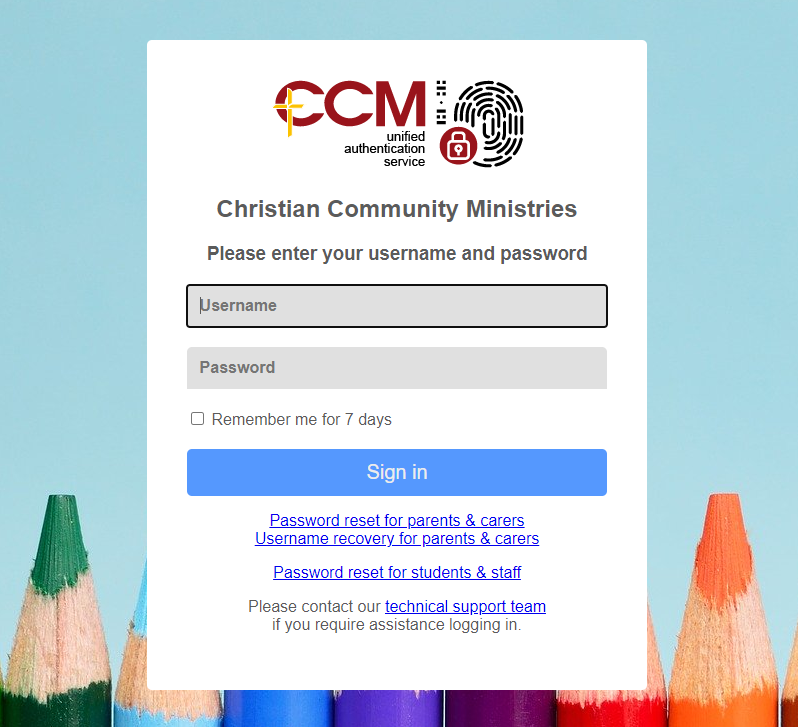
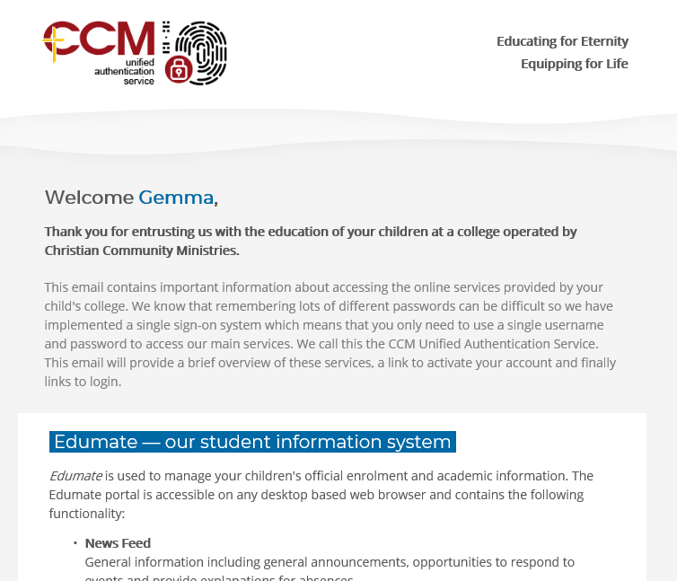

---
authors:
  - name: Cameron Weir
    email: 
    link: 
    avatar: ../static/CameronWeir_Icon.png
description: 
title: Unified Authentication FAQ
icon: 
layout: default
order: 0
visibility: public
---
# Unified Authentication Service - FAQ and Troubleshooting

The CCM Unified Authentication Service provides a single sign-on system for students, parents and staff to the following services:

1. Edumate
2. Learner.Link on Canvas​​​​​​​​​​​​​​
3. Parent Mobile Apps
4. Corporate Service Centre

## Frequently Asked Questions

#### How are parent passwords issued?
- Parent accounts will automatically be provisioned when a new parent is created in Edumate. They will automatically receive an email invitation asking them to set up their account and password. This email will be sent overnight.

#### What will the parent's login be?
- Parents will sign in using a unique system-generated username. If their email address provided to the college is unique they will also be able to use that in place of the supplied username.

#### Can parents reset their own password?
- Yes, parents can initiate a password request using email and/or SMS verification.

#### Can the parent welcome email be resent?
- Yes. Registrars, IT Managers and reception staff may request access by emailing edumate-support@ccmschools.edu.au.
- Once access is granted:
1. Select CloudWork Identity Manager on the staff app launcher dashboard.
2. Select 'users' and search for the parent.
3. Select 'Send welcome message' at the top of the screen.
4. Select 'Parent welcome email' and press submit.

#### Who is responsible for maintaining parent email addresses and mobile numbers?
- As this information is sourced directly from Edumate, college administration staff are responsible for maintaining these records.
- Staff are reminded that they should implement procedures to verify the identity of parents prior to updating contact records.

#### How does this affect staff and students?
- Student and staff accounts will continue to be maintained by local college IT Services.

#### Can our other services be connected?
- Yes, any service that supports SAML or LDAPS can be connected to enable single sign-on. For example, some schools currently use parent-teacher interview booking systems that could also be connected.

## Troubleshooting sign on issues with the Unified Authentication Service

+++ Staff & Student Errors
#### Either no user with the given username could be found, or the password you gave was wrong.

One of the following issues is present:
- The user is entering an invalid username and/or password.
- The password has has not synchronised correctly to Azure. Please initiate a password change and wait 5 minutes before trying - again
- The account is disabled.
- The account has the 'force password change at next login' flag is enabled​​​​​​​​​​​​​​.

#### Account is locked out

The user has attempted to login with invalid credentials too many times. You will need to manually unlock the account from the [CloudWorks management portal​​​​​​​](http://ccmschools.cloudworkengine.net/).

More information about how lockouts work is [available here](https://wiki.studentnet.net/index.php?title=Staggered_Logins).

#### "User not found" or similar error in Canvas & Edumate

One of the following issues is present:
- If error affects Canvas & Edumate: 
	+ The employeeID attribute in Active Directory is not set correctly to the Edumate Contact ID (SIS ID). The correct value can be most easily retrieved by viewing the user in Canvas.
- If error only affects Edumate: 
	+ The user account is not correctly configured in Edumate. This will need to be referred to the College registrar.

+++ Parent Errors

#### Parent does not know their username

The parents username is their Edumate Contact ID (SIS ID). This can be retrieved by:
- Viewing the parent in Canvas.
- Viewing the access tab in Edumate.
- Using the username recovery feature on the UAS sign-in page. This requires the account to have a unique email address associated with it.

#### Parent does not know their password

The parent must follow the password reset process on the UAS sign-in page.

#### Parent can not reset their password because their recovery details are incorrect

The College Registrar must update their email address and/or mobile phone number in Edumate. This will synchronise with the unified authentication system overnight at which point the parent can try again.

#### Parent account does not exist

This issue will need to be referred to the College Registar. The criteria for an account to be provisioned requires the following setttings in Edumate:
- The parent is linked to a current student.
- The parent is a 'report carer'.
- The parent call order is 1, 2, 3 or 4.
- The parent is enabled as a user.

#### Account is locked out

The user has attempted to login with invalid credentials too many times. You will need to manually unlock the account from the [CloudWorks management portal​​​​​​​](http://ccmschools.cloudworkengine.net/)​​​​​​​.

"User not found" or similar error in Canvas & Edumate

One of the following issues is present:
- If error affects Canvas & Edumate:
	+ Please refer the issue to edumate-support@ccmschools.edu.au
- If error only affects Edumate:
	+ The user account is not correctly configured in Edumate. This will need to be referred to the College registrar.

+++