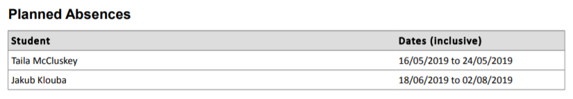
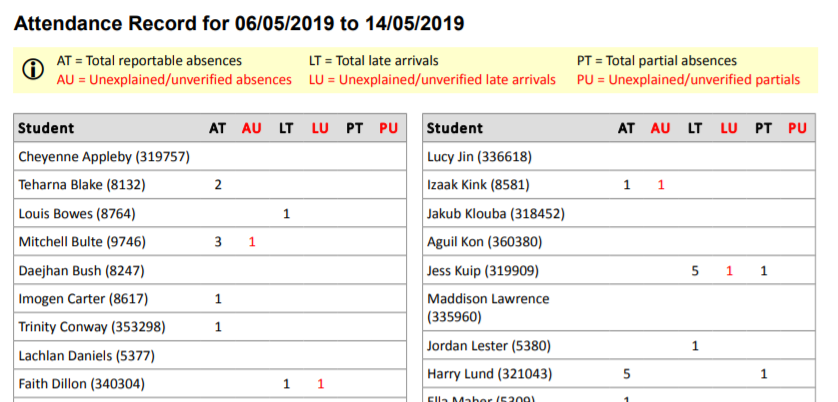
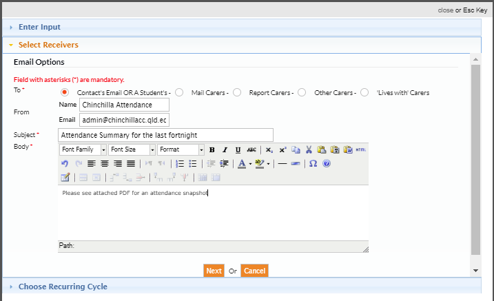
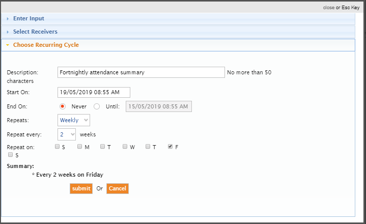

---
authors:
  - name: Sarah Dawson
    email: 
    link: 
    avatar: ../static/SarahDawson_Icon.png
description: 
title: Attendance Summaries
icon: 
layout: default
order: 0
visibility: public
---
# Attendance Summaries - snapshot of student attendance

Maintaining an watchful eye over attendance, is a school wide responsibility.  There are many layers of staff who are involved in Attendance, from student services, roll class teachers, form coordinators and Heads of School.

In light of this the following reports have been created and exist in your Edumate ready for 'scheduling' so at regular intervals a snapshot of attendance information is forwarded to the relevant staff for each student.

## *Attendance > Attendance Reports > Correspondence > Current Students*

- **Roll Class** Attendance Summary (will send to any teacher who is assigned to a 'Tutor / Roll Class'.
- **Form** Attendance Summary (will send to any teacher who has been assigned as a form coordinator under *setup > academic hierarchy > form runs*.
- **School** Attendance Summary (will send to the staff member who has been designated as your 'Head of School(s)' under *Setup > academic hierarchy > Schools*.

## What do the report(s) display?
- **Top # of students with unexplained or unverified** absences (number varies depending on report version of roll, form or school).
- **Top # of students with lates unexplained or unverified** (number varies depending on report version of roll, form or school)

## Planned Absences

Planned absences, these are any absence reasons that have been pre-recorded for students who have planned, future absences recorded in Edumate.  Some of these will be entered on the basis of a "Long Term Absence Form".

This section of the report, can not only be informative, but a call for action for teaching staff who may need to get work organised for students who will be on leave.

## Attendance Record (between a date range)

This part of the report will list ALL students who are a part of the grouping, ie the Roll Class, the Form Group or the School.

The key located under the heading will help staff to discern what the column information is report for each student.  We have:
- AT - Total reportable absences (this is regardless of whether a parent has provided explanation or not).
- AU - Total reportable absences that no explanation or reason has been provided by a carer/parent.
- LT - Total late arrivals (all regardless of whether explained or not).
- LU - Total unexplained late arrivals, that a carer/parent has not provided an explanation for.
- PT - Total partial absences is the count of how many times a student has departed early from school.
- PU - Partial unexplained absences, where a carer/parent has not provided an explanation for an early departure.

## Scheduling / Automating the emailing out of these reports

These reports can be 'scheduled' to auto send at an given interval.  You will need to setup the schedule for each report you would like to have auto sent based on the needs and staff hierarchial structure of your College (smaller Colleges are unlikely to have 'Form Coordinators').

To setup a schedule - exampled based on a fortnightly schedule:
- Go to the report location in Edumate.
- Click on 'Schedule' tab.
- Click on 'Add Schedule'.
- ALWAYS choose 'relative date.
- Select 'other options'.
- Change 'from date' to 2 weeks before.
- Change 'to date' to 'as at date'.
- Click on Next.

- Select 'Contact' as Edumate will know to select the Roll Teacher, the Form Coordinator or the Head of School based on the report.
- You can change name & email as required - if you have the right permissions :wink:.
- A subject line that will helpful to your end user.
- A short but sweet body message, referring recipients to look at the PDF with all the info.

- Description - just forms the name on the 'schedule tab' inside Edumate for your own reference.
- Starts on - select the time first and then the date. I recommend sending this on a Sunday afternoon / evening.... Edumate is quiet then!
- Repeats - Weekly.
- Repeat - every two weeks.
- Repeat on - the day you want this to send out.... oops, should have ticked 'S' for Sunday!
- Press Submit

