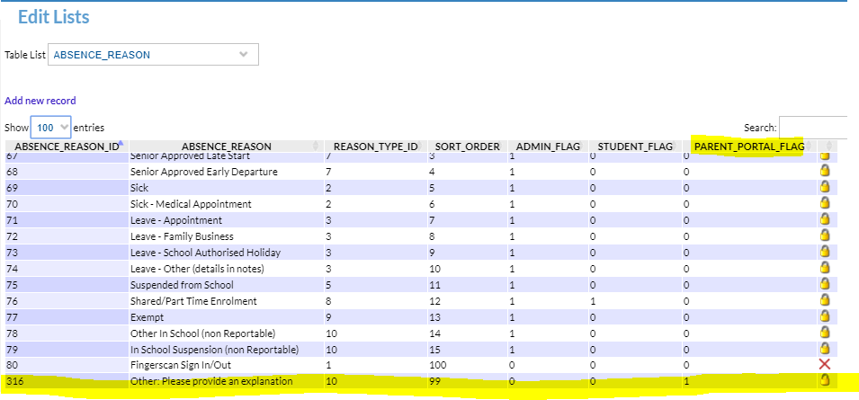
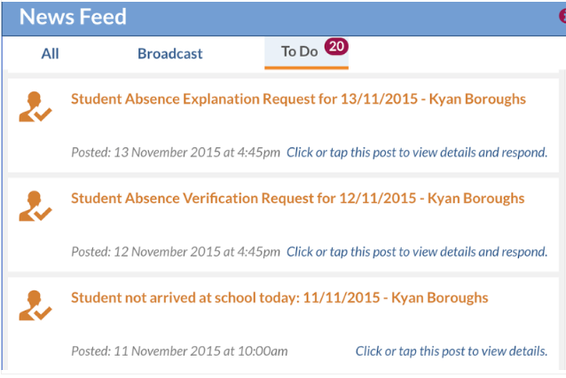
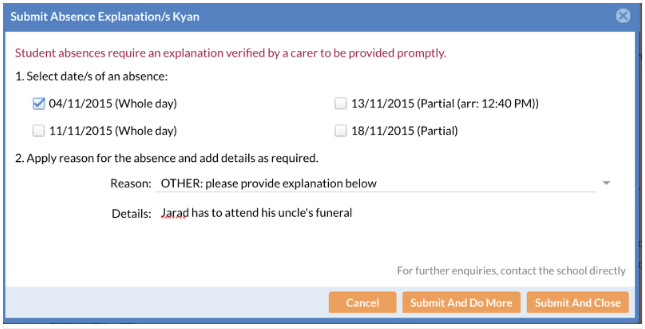
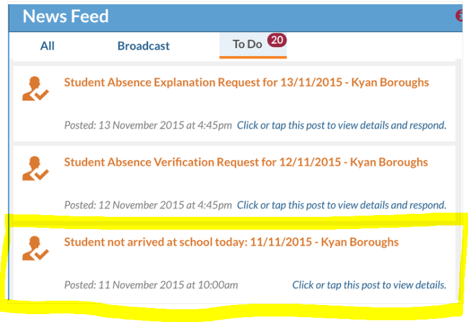
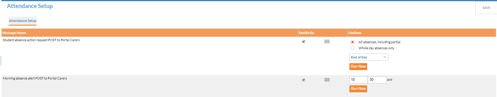
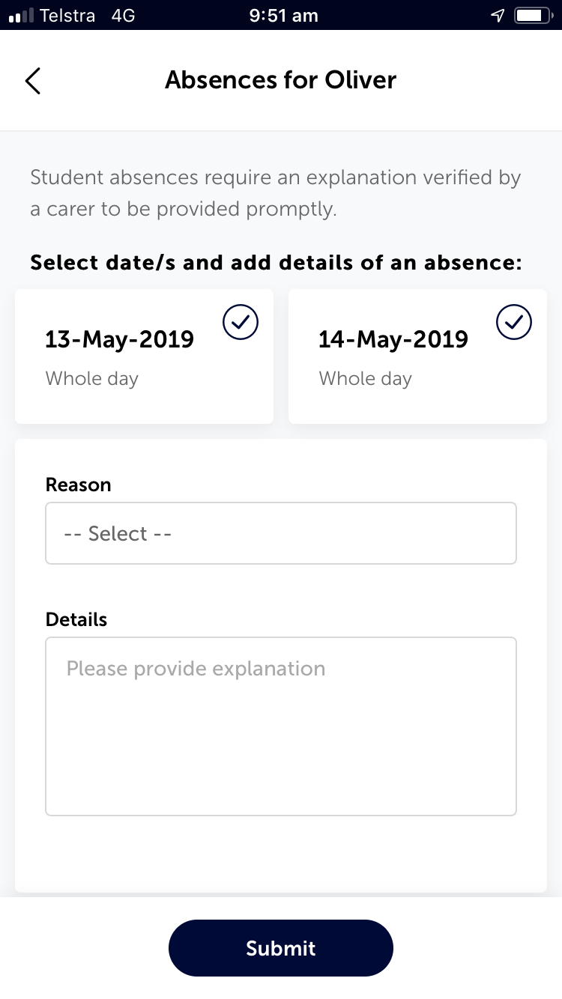
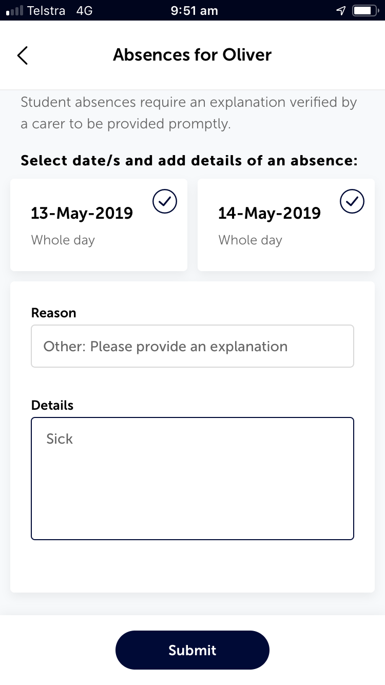

---
authors:
 - name: Sarah Dawson
   email: 
   link: 
   avatar: ../static/SarahDawson_Icon.png
description: 
title: Attendance Workflow
icon: 
layout: default
order: 0
visibility: public
---
# Attendance Workflow with MyEdumate and Parent Mobile App

With the introduction of My Edumate, and the Parent Mobile App, we have seen changes that are now available to us to help engage parents with the verification of student absences from school.

**Absence Reasons** - there is a table in Edumate (Setup > Edumate Admin > Edit Lists > Absence Reasons). This table supplies us with the reasons why a child is absent (please don't be tempted to add additional items, big implications to your attendance records!). However, in here we can also determine what a carer has access to in terms of recording an absence reason via the portal or the app. ***There is only one explanation that should be available to parents and that is "Other (please provide explanation).*** The reason for this is parents do not know (and nor do they need to) the coding that takes place behind an absence reason. By only giving one selection and asking them to 'write details' means that our attendance staff then will be able to make determinations about the abscence record.

As pictured below, the absence reason of "Other: Please provide an explanation" is the only reason that should have a '1' in the parent portal flag. This means that this is the ONLY selection a carer/parent can make via the portal or app, ensuring data integrity and an opportunity for attendance staff to check attendance verification made by parents.

In the portal a carer/parent will get a 'to-do' item for unexplained absences, each day, once the trigger has been set by attendance staff (more on that below). In the App, a notification badge will also notify parents on the 'absence' menu item, to give parents the opportunity to explain the absence.

From a carer/parent perspective in the portal (and the app is quite similar) you will not below that carers will have the opportunity to select unexplanained absence dates, the "reason" will default to "Other: please provide an explanation..." and then they will be required to type information in the details box for verification.

So, we now have the absence reason set up correctly for a carer (please check for your own College, as I know some staff have made changes!!) and we can see what is going to happen from a parent's perspective. Here are the steps that attendance staff will need to complete to initiate these triggers for carer/parents.

1. Teaching staff will mark rolls.
2. Attendance staff will sign students in/out.
3. Attendance staff will also enter in attendance explanations received by parent/carers via email, sms etc.
4. Attendance staff check that all rolls have been marked and no students present with a 'none' status on daily absences report.
5. Attendance staff check any roll marking errors and follow local procedures to fix as appropriate.
6. At approximately 10:30am attendance staff initiate the SMS to notify parent/carers of student absences.
7. Attendance staff go to Setup > Welfare & Attendance > Attendance Setup... discussed in detail below.
8. (optional) at the time of sending SMS, also press 'RUN NOW' on "Morning Absence alert Post to Portal Carers (see below what this looks like).
9. Attendance staff use Attendance > Absence Reason Register and filters to locate verifications with "Other: please provide an explanation" and reassign reasons as appropriate, according to the details provided by the carer/parent (see below).
10. At conclusion of the day, attendance staff press 'RUN NOW' on "Student absence action request to POST to Portal Carers" to trigger a notification in the app, and a to-do in the portal, where parents can input on explanations.
 
Please note, at the time of writing this post (14/05/2019) you have been advised to press 'RUN NOW' to action these triggers each time. We have not yet seen the successful automatic trigger of these events despite setting up schedules. If you would be happy to assist me with problem solving this, please go ahead and set this up. Then contact https://support.edumate.app so that we can monitor if the schedules execute as expected, and should they not, we can provide some good factual information to Edumate in order to ensure that going forward, these schedules execute every weekday, during term time, as per Edumate help files.

#### Morning absence alert POST to Portal Carers (optional)

The "Morning absence alert POST to Portal Carers" publishes to both the portal and the app, it operates a little bit like the SMS. At the time of 

It generates a POST to the app and portal, that is a text box that says "Student not arrived at school today: dd/mm/yyyy - student name. This post is for informational purposes only, it does not give parents the ability to respond or verify, as highlighted in yellow below.

#### Student absence action request POST to Portal Carers (actioned daily by attendance staff at conclusion of school day)

This trigger you have a few options as part of your setup, but please note in the image below, that it is inviting carer/parents to respond by "click or tap this post to view details and respond". Carer/Parents will be then taken the the 'absence explanation screen' as pictured and discussed above.

## Configuring Attendance Setup
- **Student Absence action request to POST to Portal Carers**
	+ Your College can choose whether you will be sending a to-do post for carers for ALL absences, including partial or ONLY whole day absences by using the radial selection.
	+ You can choose when this trigger happens, based on time intervals. I recommend at least an hour after school day ends. This will allow attendance staff every opportunity to enter in explanations and update any data discrepancies prior to the trigger sending off notifications in the portal or app.
	+ Please note, that this will use the 'final day' attendance status for each student. Therefore, DO NOT run this trigger during school time. It should only be run at the conclusion of the school day.
- **Morning absence alert POST to Portal Carers**
	+ This is optional and complimentary to sending out SMS, please note, that it is a text notificaiton and doesn't provide parents the opportunity to click and and explain, which is why schools may opt not to use this option.
	+ Please note this this is about 'who hasn't arrived at school yet, and we didn't expect them to be away today'. This is not asking for an explanation/verification request.
	+ If you use this option, please ensure that 'notify by' is ticked on, and the time has not yet lasped. Once editing time press SAVE, before pressing 'RUN NOW'.

## Attendance Staff maintaing and monitoring 'absence reasons' entered by carer/parents
- Go to Attendance > Absence Reasons Register.
- Use the "show" filter and select "Absentee Reasons".
- Change your date range accordingly.
- Click on 'Refresh List'.
- Click on "reason heading" to sort column so that all 'other: please provide explanation' reasons sit together, for quicker verifying by the attendance staff.
- Use the description column and click on 'reason' to read the details provided by the carer and re-assign the 'reason' accordingly ie to Leave - Sick etc.

The Parent Mobile App screens, after clicking on the "Absence Menu" and selecting a student. Parents will be prompted to click on the "absence menu" based on a notification badge that appears in the app, for the triggers you have set up and "run now" in Attendance Setup.

|  |  |  |
| :---: | :---: | :---: |
