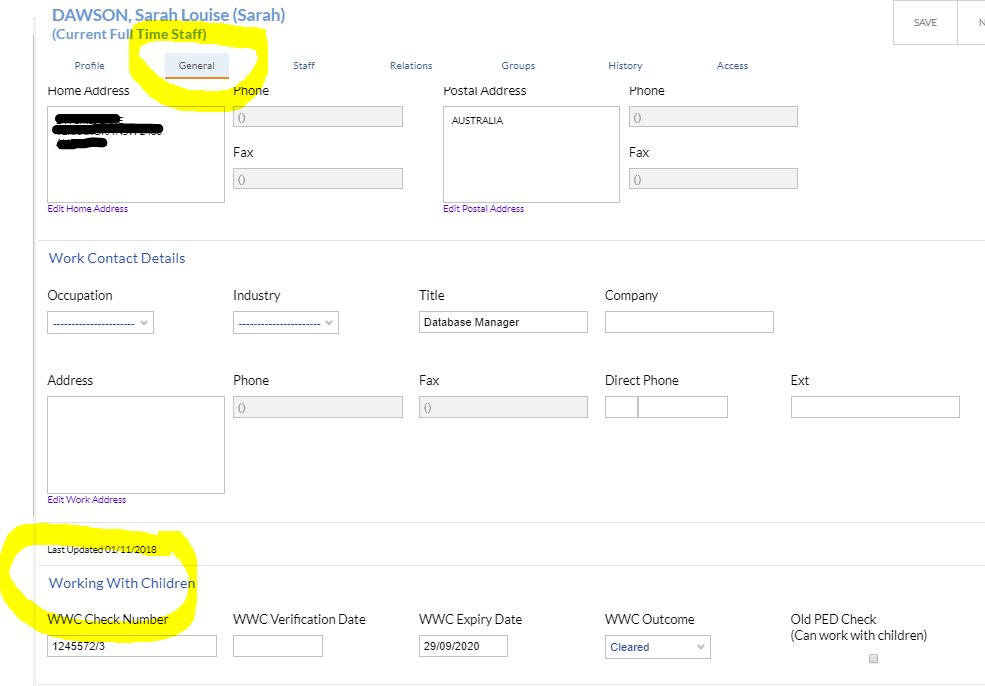

---
authors:
  - name: Sarah Dawson
    email: 
    link: 
    avatar: ../static/SarahDawson_Icon.png
description: 
title: Blue Card, Working with Children...
icon: 
layout: default
order: 0
visibility: public
---
# Blue Card, Working with Children or Police Checks for Staff / Volunteers

There is provision to record this important information for staff and volunteers in Edumate.  You will find the fields at the bottom of the 'General' tab of any Carer/Parent or Staff member, as picutred below.

There are a number of reports then available in Edumate to help you identify expiry dates on this information they are:

*Setup Reports > General Reports > Module > Staff Management*
- Staff - Blue Card / Working with Children Expired. 
- Blue Card / Exemption Card Register (QLD based).
- Staff - Working with Children Register (NSW based). 
- Teacher Registration / Blue Card List.

The above reports are for a school to be able to manage and identify staff as a whole.

However, another report exists, that can be automated to automatically send to staff, identifying for them the need to act on their upcoming expiry

*Setup Reports > General Reports > Correspondence > Staff Management*
- [Blue Card Expiry Notification](https://ccmschools.sharepoint.com/:b:/r/sites/CorporateSystems/Shared%20Documents/3701312_38316.pdf?csf=1&web=1&e=QTtPep) (QLD specific, but happy to setup other staff specific versions)
	+ When scheduled, sends a reminder email to staff who have blue cards expiring in the next four months. Enter narration text to explain who they should see at your school.  Schedule could be set to send monthly.  This means staff that would be reminded on a monthly basis until Blue Card information had been udpated in Edumate.

<iframe width="700" height="600" frameborder="0" src="https://ccmschools.sharepoint.com/:b:/r/sites/CorporateSystems/Shared%20Documents/3701312_38316.pdf?csf=1&web=1&e=QTtPep&amp;action=embedview&amp;wdAr=1.7777777777777777"></iframe>