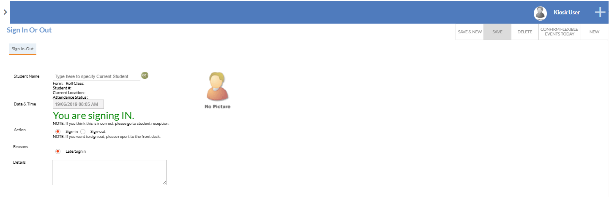
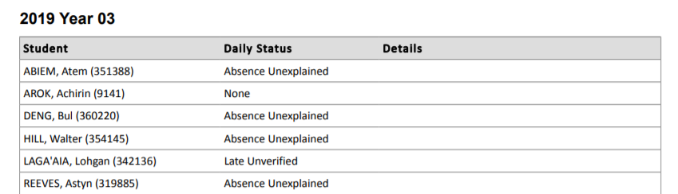
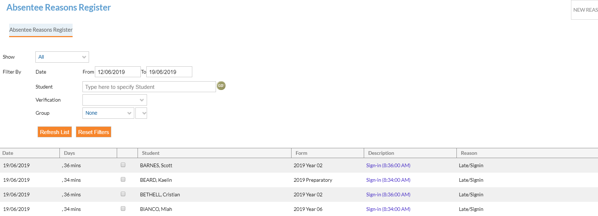

---
authors:
 - name: Cameron Weir
  email: 
  link: 
  avatar: ../static/CameronWeir_Icon.png
description: 
title: Student Kiosk
icon: 
layout: default
order: 0
visibility: public
---
# Student Kiosk for Sign In / Out

A student kiosk can be set up for students to sign themselves in late (also can be setup for Senior students, but this outline does not include that information). For students who sign in late using the absence reason of "Late Sign in" which will be the only reason available to them, this reason still requires verification from the carer / parents. While students will be recorded as late and now onsite at school, it is important that this partial absence is verified by a carer/parent so that parents are aware of the student's attendance at the College.

## Setting Up a Kiosk
1. **Create a "student" contact as follows:**
	a. General tab:
		i. Firstname: Kiosk
		ii. Lastname: User
	b. Group tab:
		i. 'student' and 'user' contact types ticked on
		ii. Add Group "#CCM - Sign In Out Kiosk
	c. Access tab:
		i. Tick on 'active user', 'password never expires' and 'do not use LDAP'
		ii. Username: Kiosk
		iii. Password: KioskBCCC (College Initials) - suggestion only
2. **Absence Reasons table**
	a. *Setup > Edumate Admin > Edit Lists > Absence Reason*
		i. Late Sign In - put a "1" in the student_flag column
		ii. Make sure there are no other "1" present in the student flag option. As mentioned before it is possible to setup Senior Flexible timetable options, but not advisable in the first instance of setup.
3. **Testing your setup**
	a. Log out of Edumate and back in as user Kiosk
	b. Go to the Plus menu (top right corner) and select *Attendance > Sign In*, this is the screen where students will be able to select their name and be encouraged to type in details explaining why they are late.

## Monitoring Late Sign Ins by Students

While allowing students to sign in late should be a time saver for your Student Services staff, it is still important to monitor the activity of students and also monitor the data entered by the students. At times and as you know individual circumstances, your student services may be able to update 'Late Sign Ins' and re-assign the 'reason' for students who have sign in late (in much the same way, we do for parents who provide verification via the portal or app in looking for absences reasons of 'Other: please provide explanation).

There are a few ways to monitor student entries:
- Some Edumate Schools setup dual monitors, so that Student Services staff can see what is being entered by a student (with a quick glance, while completing other duties). I even know one School, where the secondary monitor for staff doesn't work, just helps to keep students honest :slightly_smiling_face:.
- Daily Absences report - which all Colleges should be using to monitor attendance in terms of 'none' attendance, and as a quick check. Any student that comes through on the report (as shown below) with a "Late Unverified" and has provided "Details", potentially the reason could be reassigned, IF it was a late bus, or you know family circumstances and know that the late sign in, does not require following up.
- *Attendance > Absence Reason Register* (as pictured below), checking any "Late/Sign In" for details provided by clicking on blue link of "sign in".
 

## Carer / Parent view of "Late sign in"

So the result of a 'Late sign in' that isn't where details are not provided, any College staff do not adjust ie 'Late Bus' etc, means that in a Parent Portal or Parent Mobile App, that parents will receive "partial" absence notifications, where they will be asked to provide an explanation. This is a great way to ensure that Carers do know if a child is consistently late, especially without a valid reason or a family explanation.

Parents will be provided an opportunity to provide an explanation, like they are with any other absence. Edumate clearly reflects, that it is a Parital Absences, along with the 'arrival' time of the student that has been recorded.

Parents should ONLY have permission to use the reason of "Other: Please provide explanation" and then write an explanation in the "details" box, for your attendance staff to then use their judgement and assign the appropriate "Leave-" reason based on the information provided by the parent. College Staff again will use the *Attendance > Absentee Reasons Register* to locate any "Other: please provide...." entries made and update accordingly.

## Hardware Required

- A computer or tablet available and designated for the use of Student Kiosk, that can be signed into Edumate as the user "Kiosk"
	+ Keyboard & Mouse, for student to type names and provide details for sign in
- OPTIONAL - Barcode Scanner - please note, that the barcode scanner will scan a student's student number as recorded in Edumate. The student number must be printed in the font called "3of9Barcode" which is a font that can be dowloaded for free. There are no hardware requirements for the barcode scanner, other than that it works well in conjunction with the machine/workstation that the College has it connected to.