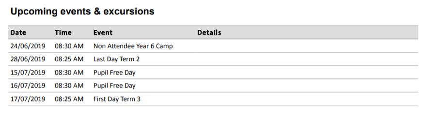
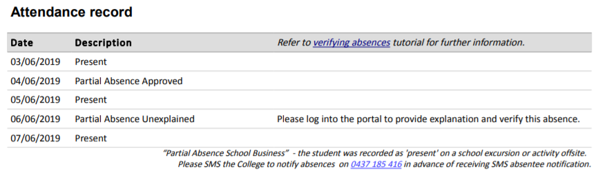
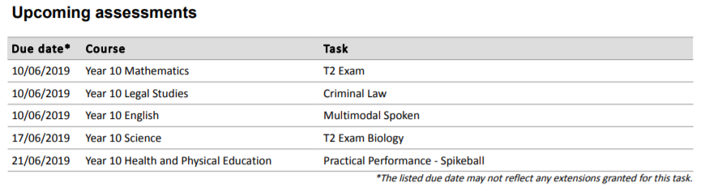
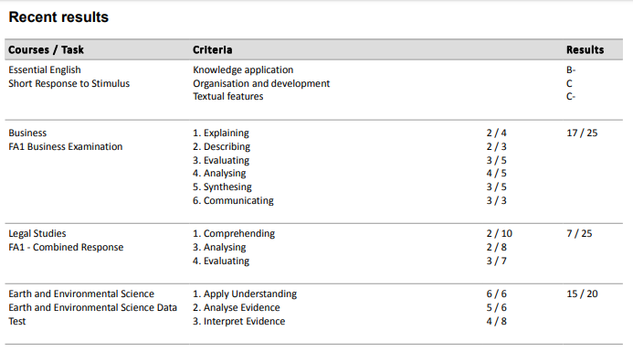
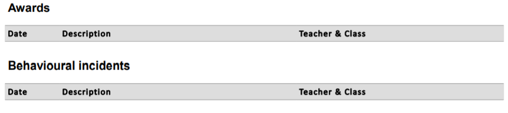

---
authors:
  - name: Sarah Dawson
    email: 
    link: 
    avatar: ../static/SarahDawson_Icon.png
description: 
title: Weekly Summaries
icon: 
layout: default
order: 0
visibility: public
---
# Weekly Summaries (to carers and/or students)

The updating of this information has been prompted by a change in how "Upcoming events" is being populated into your Weekly Summaries.  As of 20/6/2019, an event for a student will not displayed on a Weekly Summary if a parent or administration has set the permission for the student to 'No'.  Where student permission for an event is either 'Yes' or 'None', the event will be continued to be displayed as part of the 'Upcoming events' summary for students and their carers.

While this updating took place, I have also taken the opportunity to explain how the Weekly Summary works.  I quite often get questions clarifying attendance status', missing attendance, markbook entries, etc.  I have therefore outlined below, how the Weekly Summaries work in each section, and what data is collated to form the section.  I trust that this gives you some insights in to ensure data integrity for information that is already available via the Portal and Parent Mobile App, but also being published as an email to Carers and/or students as per individual College setup.

I have always maintained that Weekly Summaries provide our communities great customer care, especially if we focus on ensuring data integrity for all that gets included in them.  It is a great way to ensure families receive a summary notice on school life, all the things that matter specifically to their child (and not having to wade through a whole college calendar for example).  While, it is available to them via the Edumate Portal and Parent Mobile app, it is the culmination of all information per student in a one page summary for families, delivered to their inbox.

So what is a Weekly Summary? Well it is the collation of events, attendance, markbook and welfare entries and generated on a per student basis.  The Weekly Summary is designed to be scheduled to be automatically sent to every current student's mail carer once per week.  

So as a College, what is it important to know and understand about Weekly Summaries (any iteration of it)....

Weekly Summaries that are regularly updated and maintained by CCM are under **General Reports > Correspondence > Current Students**:
- Weekly Summary (excluding Markbook)
- Weekly Summary (with markbook)
- Weekly Summary - Primary
- Weekly Summary - Secondary

and to generate by student number for checking, re-distribution etc:
- Weekly Summary - Primary (by Student #)
- Weekly Summary - Secondary (by Student #)

## Upcoming Events

This part of the report will collate all events that a student is assigned to under the 'people' tab of the event (where their permission status is either 'Yes' or 'None') regardless of the publish ticks on the event screen.  If a student is attached to an event, it is included in the report.  The report will collect all events from the date the report is generated + 30 days ahead.  If a student's permission is set to 'No' on the people tab, either by an administrator or by a carer denying permission, the event will not be included in the student's list of upcoming events.

The Upcoming events and excurions table will list the start date, time, event name and any information entered into the details box from the event main screen in Edumate.

There are reports available in Edumate to help identify where students have been entered on conflicting events, important to identify and fix these types of clashes in order to accurately inform parents/students of events that will be participating in.

## Attendance

The report will list all attendance for a student for the past 7 days (obviously it doesn't show data for the weekend, but looks at the last 7 days, so that schools an automatically send the report whatever day of the week they like, and know that a full school week of attendance will be displayed.

There is often questions of the attendance status of 'Partial Absence School Business', there is text under the table to explain this, but also for you understanding please note the following.  Any time a student is recorded as 'offiste' for an excursion, the data in the background is recorded as a 'partial absence school business', this absence DOES NOT go towards an absence total for a student.  In fact for a student this is counted as a day at school.  However, for evacuation purposes, these students are recorded as 'offiste', so that when an evacuation report is run, staff are not looking for students who are not onsite (provided rolls are marked in Edumate prior to an event leaving school grounds).

Carer/Parents are encouraged to log into the portal or app to confirm or verify any absences.  In terms of attendance 'follow up' that is required within a 7 day period, this is one process that can aid Colleges in moving towards have absences explained and verified.

If there are days missing (ie not 5 days listed in the attendance table for a student), the likelihood is that a roll has been left unmarked for the student.  This can always be checked by going to Attendance > View Student Attendance.

## Upcoming assessments*

*This section is excluded from the Weekly Summary - Primary and Weekly Summary (excluding markbook) versions of the reports.

Upcoming assessments are all 'COURSEWORK' OR 'CLASSWORK' Learning Tasks that has a course work due date between the date of generating + 30 days, for any course that a student is currently enrolled in.

If different classes have different due dates due to timetabling, provision in the report has been made to reflect the change of dates, please note that the "*the listed due date may not reflect any extensions granted for this task" is included for individual student extension, or provision for staff who aren't yet familiar with how to set different due dates per class.

The fields that are displayed are directly from the learning task:
- Due date (as recorded on task, or per class)
- Course Name (as per Setup > Academic Hierachy > School Courses setup)
- Task - task title as entered by teaching staff in learning task area of Edumate.  It is important that this task title makes sense to all end users.

## Recent results

Recent results, is any markbook entries for students between the current date and minus 30 days that have had data updated AND that from the learning task screen have had the 'Release Marks to Portal Pages' unticked.  If this tick stays in place, the results are not released to the students/carers either via the portal/app or the Weekly Summary.

The data includes is:
- Course name
- Task Title (from learning tasks)
- Criteria (as selected on Criteria tab for non General ATAR subjects, or as entered in 'mark workings' for General ATAR subjects) - QLD language here :)
- Results - from the markbook screen, per student.

## Awards & Behaviour 

This is two discrete sections on the weekly summaries, but operate in the same way.  Every College has a different welfare setup, but the data that will be populated into the weekly summaries is consistent.
- Date (recorded date of award or discipline as displayed on the screen, should be the day the 'incident' happened)
- Description - the 'What Happened' drop down selection, with anything entered in the 'print details' box
- Teacher & Class - the staff member and class that have been recorded on the screen, if teachers are recording their own in real time, this will be populated correctly for them.

## Setting Up a Schedule

Most Colleges already have this in place, but for new comers, changes of practice, or those ready to embark on this automation here is how to set up the schedule.

Navigate to the report of choice as itemised above.
- Click on the Schedule tab.
- Select 'Relative Date' - always RELATIVE.
- Select 'As at [date]'.
- Click on Next.
- "To" - you may want to set up two schedules (for the secondary versions), one to the students, one to the carers:
	+ 'Mail Carers' to send to carers, so that all carer are included regardless of living arrangements.
	+ 'Contacts' to send to students.
- From, and subject as required.
- Body - example would be, "Please see attached the Weekly Summary for your student".
- Click on Next.
- Description - this is the name of the schedule ie 'Weekly Summary - for carers on Fridays weekly'.
- Start On - always choose the time first and then the date you want it to start from.  I recommend selecting a time outside of school hours, so that the report does not interfere with Eduamte's performance at crucial times like roll marking etc.  Weekends like a Sunday afternoon are even ideal!
- End On - never.
- Repeats - Weekly, and tick day of week it will generate ie 'Sunday'.
- Repeat every - [1] week.
- Submit.