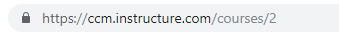

---
authors:
  - name: Cameron Weir
    email: 
    link: 
    avatar: ../static/CameronWeir_Icon.png
description: 
title: Composite Courses
icon: 
layout: default
order: 0
visibility: public
---
# Setting up composite or combined courses

By default, a course is created for each year level class. If you need to combine your courses because you teach multiple year levels concurrently, please follow these instructions:

Firstly you will need to obtain the URL from the address bar of each course that needs to be merged together.

Once you have obtained the course URLs select the **:question: Help** icon and then select '[Get Technical Support](https://ccm-learnerlink.paperform.co/)' to submit a request.