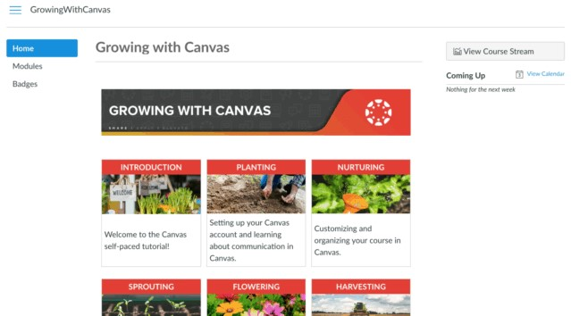

---
authors:
  - name: Cameron Weir
    email: 
    link: 
    avatar: ../static/CameronWeir_Icon.png
description: 
title: Growing with Canvas
icon: 
layout: default
order: 0
visibility: public
---
# "Growing with Canvas" staff training course

Knowing where to begin when you are brand new to Canvas can be very daunting. *Growing with Canvas* has five modules of content that will take users through everything they need to know about using Canvas at their institutions - no matter what grade or level. The course uses a combination of the Canvas Video Guides and Canvas Guides to teach the content. Participants in the course will try out a number of the concepts through the practice activities.

*Growing with Canvas* is available to all CCM staff. You should already be enrolled in the course, however if you have not yet been you may request access by contacting help@learner.link.

Teachers will receive six hours of professional development credit upon successful completion of the course.

